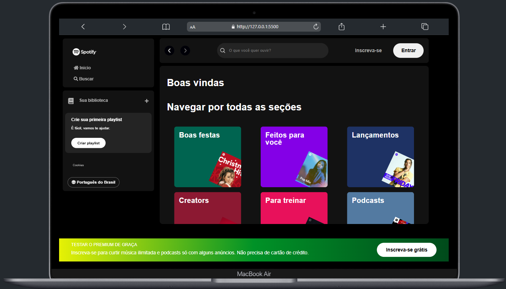

# 🎧 Projeto Inspirado no Spotify - Imersão Front-end da Alura

Este projeto foi desenvolvido durante a **Imersão Front-end da Alura**, com o objetivo de criar uma interface moderna inspirada no **Spotify**, utilizando HTML, CSS e JavaScript.

## 💡 Sobre o Projeto


A proposta principal foi criar uma página web com:

- Cartões personalizados com artistas musicais.
- Busca de artistas por **nome ou gênero**.
- Exibição de resultados em tempo real, sem recarregar a página.
- Consumo de uma **API simulada** usando JSON Server.

## 🔍 Funcionalidade de Pesquisa

A busca funciona em **tempo real**, filtrando os artistas conforme o usuário digita, seja pelo nome ou gênero musical. Também foi utilizada a técnica de **debounce** para evitar requisições excessivas à API.

## 🛠️ Tecnologias Utilizadas

- **HTML5**
- **CSS3**
- **JavaScript (ES6+)**
- **JSON Server** (para simular a API)
- **Fetch API**
- Manipulação dinâmica do DOM

## 📸 Preview do Projeto

Você pode acessar o site rodando localmente ou subir com GitHub Pages.



---

## 🚀 Como Executar o Projeto

### 1. Clone o repositório

```bash
git clone https://github.com/Waldemarleo/Spotify-homePage.git
cd Spotify-homePage
```

### 2. Instale o JSON Server (caso ainda não tenha)

```bash
npm install -g json-server
```

### 3. Inicie o servidor da API local

```bash
json-server --watch artists.json --port 3000
```

A API estará disponível em: [http://localhost:3000/artists](http://localhost:3000/artists)

### 4. Abra o arquivo `index.html` no navegador

Você pode dar um duplo clique no arquivo ou usar a extensão **Live Server** no VS Code.

---

## ✍️ Autor

Projeto desenvolvido por **Waldemar Leonardo** durante a Imersão Front-end da Alura.

🔗 [GitHub](https://github.com/Waldemarleo)  
🔗 [LinkedIn](https://www.linkedin.com/in/waldemar-leonardo/)

---

---

⚠️ *Este é um projeto fictício criado para fins educacionais.*
